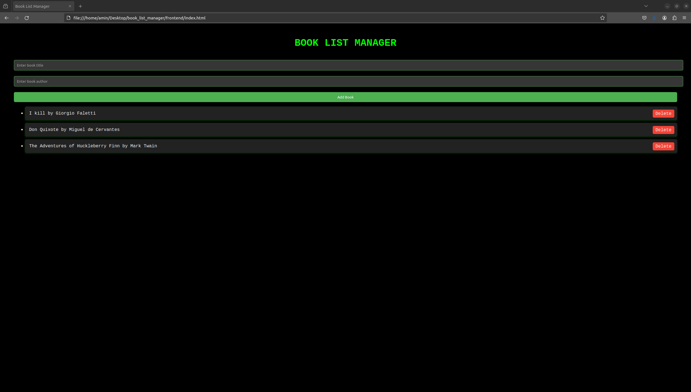

# Book List Manager

A simple web application to manage a list of books.

## Features

- Add books with their titles and authors.
- Display a list of added books.

## Technologies Used

- HTML
- CSS
- JavaScript

## Usage

1. Enter the title and author of a book in the provided input fields.
2. Click the "Add Book" button to add the book to the list.
3. The added books will be displayed below the input fields.

## Project Structure

- `index.html`: HTML file containing the structure of the web page.
- `styles.css`: CSS file containing styles for the web page elements.
- `script.js`: JavaScript file containing functionality for adding books to the list.

## Preview

## How to Run

Simply open the `index.html` file in a web browser to run the application locally.

## License

This project is licensed under the MIT License - see the [LICENSE](LICENSE) file for details.
